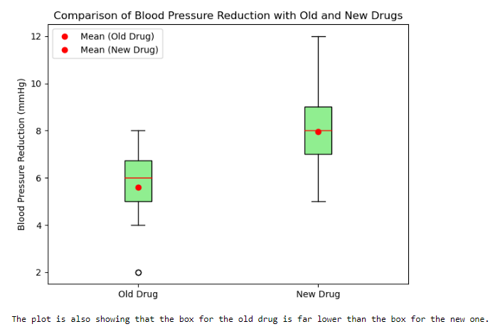

#  Using P-Value For Testing Effectiveness Of Blood Pressure Drugs
> **Brief Description:** Testing if a new drug lowers blood pressure more effectively than an old drug.
> 

---

## Table of Contents

- [Description](#description)
- [Video Explanation](#video)
- [Technologies Used](#technologies-used)
- [Dataset](#dataset)
- [Program Codes ](#program-codes)
- [Screenshots](#screenshots-and-explanations)
- [Contribution](#contributipn)
- [Contact Details](#contact-details)

---

## Description

Testing if a new drug lowers blood pressure more effectively than an old drug.

**Hypothesis**
- Null Hypothesis (H₀): There is no difference in the blood pressure reduction between the new and old drugs.
- Alternative Hypothesis (H₁): The new drug lowers blood pressure more effectively than the old drug.

**Group Formation**
- We have randomly picked up patients from the each group being treated by old drug and new drug. 

**Sample Size**
- Sample size is 30. We checked the reduction level in 30 patients in each group.

## Video
<!--
 
-->

We are working on this section. Please check at some other time.

## Technologies-used

Python programming language, pandas and matplotlib package.

## Dataset

The data set is synthetically generated and used for demonstrating the concept only. The program can be easily modified to show results with real readings taken from the patients.

## Program-codes

The programs are written on jupiter notebook, You may run the program on Google colab by clicking on the colab badge below.

## Screenshots and explanations

### Conclusion
Now we have strong evidence to conclude that the new drug significantly reduces blood pressure more effectively than the old drug.

## Contribution

The programs are written by Santanu Karmakar

## Contact-details

If you wish to contact me, please leave a message (Preferably WhatsApp) on this number: 6291 894 897.
Please also mention why you are contacting me. Include your name and necessary details.
Thank you for taking an interest.
