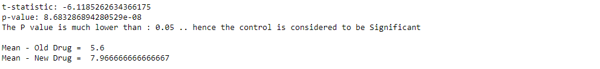

#  Using P-Value For Testing Effectiveness Of Blood Pressure Drugs
> **Brief Description:** Testing if a new drug lowers blood pressure more effectively than an old drug.
> 

---

## Table of Contents

- [Description](#description)
- [Video Explanation](#video)
- [Technologies Used](#technologies-used)
- [Dataset](#dataset)
- [Program Codes ](#program-codes)
- [Screenshots](#screenshots-and-explanations)
- [Contribution](#contributipn)
- [Contact Details](#contact-details)

---

## Description

Testing if a new drug lowers blood pressure more effectively than an old drug.

**Hypothesis**
- Null Hypothesis (H₀): There is no difference in the blood pressure reduction between the new and old drugs.
- Alternative Hypothesis (H₁): The new drug lowers blood pressure more effectively than the old drug.

**Group Formation**
- We have randomly picked up patients from the each group being treated by old drug and new drug. 

**Sample Size**
- Sample size is 30. We checked the reduction level in 30 patients in each group.

## Video
<!--
 
-->

We are working on this section. Please check at some other time.

## Technologies-used

Python programming language, pandas and matplotlib package.

## Dataset

The data set is synthetically generated and used for demonstrating the concept only. The program can be easily modified to show results with real readings taken from the patients.

## Program-codes

The programs are written on jupiter notebook, You may run the program on Google colab by clicking on the colab badge below.

## Screenshots and explanations

### How independent and depended variables are plotted on the graph?
In a graph, the dependent and independent variables are typically plotted as follows:

- Independent Variable: This is plotted on the x-axis (horizontal axis).
- Dependent Variable: This is plotted on the y-axis (vertical axis).

The independent variable is the one you manipulate or consider as the input, while the dependent variable is the outcome or the response that you measure.

### How confounding variables are plotted on the graph?
Confounding variables are typically not plotted directly on the main graph of independent vs. dependent variables. Instead, they are often accounted for through statistical methods or visualized in additional plots to show their potential influence.

However, if you need to visualize the effect of confounding variables, you can use:

- Stratified Graphs: Create separate plots for different levels or groups of the confounding variable.
- Multivariable Plots: Use 3D plots or color-coding in scatter plots to represent the confounding variable.

These methods help illustrate how the confounding variables might be influencing the relationship between the independent and dependent variables.

### Case study featuring these variables

Example of a stratified graph showing the relationship between _age_ (independent variable) and _blood pressure_ (dependent variable) for two groups: smokers and non-smokers. Each subplot represents one group, allowing you to see how the confounding variable (_smoking status_) may influence the relationship between age and blood pressure.### How independent and depended variables are plotted on the graph?
In a graph, the dependent and independent variables are typically plotted as follows:

- Independent Variable: This is plotted on the x-axis (horizontal axis).
- Dependent Variable: This is plotted on the y-axis (vertical axis).

The independent variable is the one you manipulate or consider as the input, while the dependent variable is the outcome or the response that you measure.

### How confounding variables are plotted on the graph?
Confounding variables are typically not plotted directly on the main graph of independent vs. dependent variables. Instead, they are often accounted for through statistical methods or visualized in additional plots to show their potential influence.

However, if you need to visualize the effect of confounding variables, you can use:

- Stratified Graphs: Create separate plots for different levels or groups of the confounding variable.
- Multivariable Plots: Use 3D plots or color-coding in scatter plots to represent the confounding variable.

These methods help illustrate how the confounding variables might be influencing the relationship between the independent and dependent variables.

### Case study featuring these variables

Example of a stratified graph showing the relationship between _age_ (independent variable) and _blood pressure_ (dependent variable) for two groups: smokers and non-smokers. Each subplot represents one group, allowing you to see how the confounding variable (_smoking status_) may influence the relationship between age and blood pressure.

Here is a 3D plot representing the relationship between _age_ (x-axis), _blood pressure_ (y-axis), and _smoking status_ (z-axis, with 1 representing smokers and 0 representing non-smokers). This visualization allows you to see the combined effect of age and smoking status on blood pressure in a single graph.

## Contribution

The programs are written by Santanu Karmakar

## Contact-details

If you wish to contact me, please leave a message (Preferably WhatsApp) on this number: 6291 894 897.
Please also mention why you are contacting me. Include your name and necessary details.
Thank you for taking an interest.
